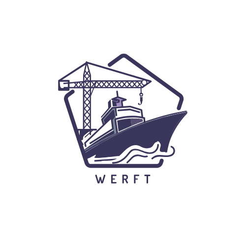

[](https://gitpod.io/#https://github.com/32leaves/werft) 

<center></center>

# Werft
Werft is a Kubernetes-native CI system. It knows no pipelines, just jobs and each job is a Kubernetes pod.
What you do in that pod is up to you. We do not impose a "declarative pipeline syntax" or some groovy scripting language.
Instead, Werft jobs have run Node, Golang or bash scripts in production environments.

## Installation
The easiest way to install Werft is using its [Helm chart](helm/).
Clone this repo, cd into `helm/` and install using 
```
helm dep update
helm upgrade --install werft .
```

### GitHub
For the time being Werft has a strong GitHub dependency. For a werft server to run you'll need a GitHub app.
To create the app, please [follow the steps here](https://developer.github.com/apps/building-github-apps/creating-a-github-app/).

When creating the app, please use following values:

| Parameter | Value | Description |
| --------- | ----------- | ------- |
| `User authorization callback URL` | `https://your-werft-installation.com/github/app` | The `/github/app` path is important, the domain should match your installation's `config.baseURL` |
| `Webhook URL` | `https://your-werft-installation.com/github/app` | The `/github/app` path is important, the domain should match your installation's `config.baseURL` |
| `Permissions` | Contents: Read-Only | |
| | Commit Status: Read & Write | |
| `Events` | Meta | |
| | Push | |

### Configuration

The following table lists the configurable parameters of the Werft chart and their default values.

| Parameter | Description | Default |
| --------- | ----------- | ------- |
| `github.webhookSecret` | Webhook Secret of your GitHub application. See [GitHub Setup](#github) | `my-webhook-secret` |
| `github.privateKeyPath` | Path to the private key for your GitHub application. See [GitHub setup](#github) | `secrets/github-app.com` |
| `github.appID` | AppID of your GitHub application. See [GitHub setup](#github) | `secrets/github-app.com` |
| `github.installationID` | InstallationID of your GitHub application. Have a look at the _Advanced_ page of your GitHub app to find thi s ID. | `secrets/github-app.com` |
| `config.baseURL` | URL of your Werft installatin | `https://demo.werft.dev` |
| `config.timeouts.preperation` | Time a job can take to initialize | `10m` |
| `config.timeouts.total` | Total time a job can take | `60m` |
| `github.appID` | AppID of your GitHub application. See [GitHub setup](#github) | `secrets/github-app.com` |
| `image.repository` | Image repository | `csweichel/werft` |
| `image.tag` | Image tag | `latest` |
| `image.pullPolicy` | Image pull policy | `Always` |
| `replicaCount`  | Number of cert-manager replicas  | `1` |
| `rbac.create` | If `true`, create and use RBAC resources | `true` |
| `resources` | CPU/memory resource requests/limits | |
| `nodeSelector` | Node labels for pod assignment | `{}` |
| `affinity` | Node affinity for pod assignment | `{}` |


Specify each parameter using the `--set key=value[,key=value]` argument to `helm install`.

Alternatively, a YAML file that specifies the values for the above parameters can be provided while installing the chart. For example,

```console
$ helm install --name my-release -f values.yaml .
```
> **Tip**: You can use the default [values.yaml](values.yaml)


### OAuth
Werft does not support OAuth by itself. However, using [Vouch](https://github.com/vouch/vouch-proxy) that's easy enough to add.

## Setting up jobs
Wert jobs are files in your repository where one file represents one job.
A Werft job file mainly consists of the [PodSpec](https://kubernetes.io/docs/reference/generated/kubernetes-api/v1.17/#podspec-v1-core) that will be run.
Werft will add a `/workspace` mount to your pod where you'll find the checked out repository the job is running on.

For example:
```YAML
pod:
  containers:
  - name: hello-world
    image: alpine:latest
    workingDir: /workspace
    imagePullPolicy: IfNotPresent
    command:
    - sh 
    - -c
    - |
      echo Hello World
      ls
```
This job would print Hello World and list all files in the root of the repository.

Checkout [werft's own build job](.werft/build-job.yaml) for a more complete example.

> **Tip**: You can use the werft CLI to create a new job using `werft init job`

### GitHub events
Werft starts jobs based on GitHub push events if the repository contains a `.werft/config.yaml` file, e.g.
```YAML
defaultJob: ".werft/build-job.yaml"
rules:
- path: ".werft/deploy.yaml"
  matchesAll:
  - or: ["repo.ref ~= refs/tags/"]
  - or: ["trigger !== deleted"]
```

The example above starts `.werft/deploy.yaml` for all tags. For everything else it will start `.werft/build-job.yaml`.

## Log Cutting
Werft extracts structure from the log output its jobs produce. We call this process log cutting, because Werft understands logs as a bunch of streams/slices which have to be demultiplexed.

The default cutter in Werft expects the following syntax:

| Code | Command | Description |
| --------- | ----- | ----------- |
| `[someID\|PHASE] Some description here` | Enter new phase | Enters into a new phase identified by `someID` and described by `Some description here`. All output in this phase that does not explicitely name a slice will use `someID` as slice.
| `[someID] Arbitrary output` | Log to a slice | Logs `Arbitrary output` and marks it as part of the `someID` slice.
| `[someID\|DONE]` | Finish a slice | Marks the `someID` slice as done. No more output is expected from this slice in this phase.
| `[someID\|FAIL] Reason` | Fail a slice | Marks the `someID` slice as failed becuase of `Reason`. No more output is expected from this slice in this phase. Failing a slice does not automatically fail the job.
| `[type\|RESULT] content` | Publish a result | Publishes `content` as result of type `type` 

> **Tip**: You can produce this kind of log output using the Werft CLI: `werft log`

## Command Line Interface
Werft sports a powerful CI which can be used to create, list, start and listen to jobs.

### Installation
The Werft CLI is available on the [GitHub release page](https://github.com/32leaves/werft/releases), or using this one-liner:
```bash
curl -L werft.dev/get-cli.sh | sh
```

### Usage
```
werft is a very simple GitHub triggered and Kubernetes powered CI system

Usage:
  werft [command]

Available Commands:
  help        Help about any command
  init        Initializes configuration for werft
  job         Interacts with currently running or previously run jobs
  log         Prints log-cuttable content
  run         Starts the execution of a job
  version     Prints the version of this binary

Flags:
  -h, --help          help for werft
      --host string   werft host to talk to (defaults to WERFT_HOST env var) (default "localhost:7777")
      --verbose       en/disable verbose logging

Use "werft [command] --help" for more information about a command.
```

## Attribution

Logo based on [Shipyard Vectors by Vecteezy](https://www.vecteezy.com/free-vector/shipyard)

## Thank You
Thank you to our contributors:

- [csweichel](https://github.com/csweichel)
- [corneliusludmann](https://github.com/corneliusludmann)
- [jankeromnes](https://github.com/jankeromnes)
- [JesterOrNot](https://github.com/JesterOrNot)
